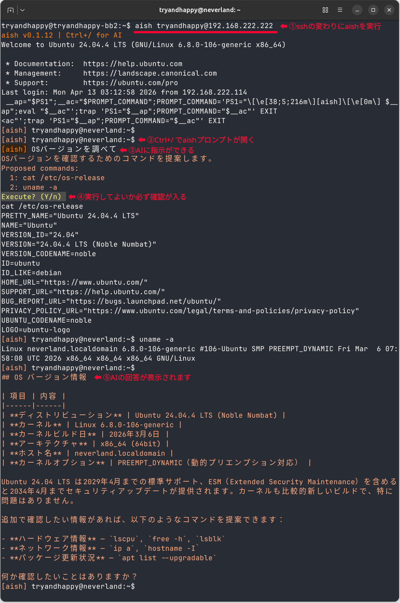

# aish (AI + SSH)

**AI-assisted SSH shell** — Ask Claude Code for help right inside your SSH session.

- `aish` は AI + SSH です。 `ssh` の代わりに使えるCLIです。
- SSHしながら、`Ctrl+/` で Claude Code に指示できます。
- AIは画面の内容を見ているので、エラーやログを貼り付ける必要はありません。
- コマンド実行時は必ず確認が入るので安心です。
- サーバにClaude Code CLIをインストールする必要がありません。



## デモ動画

**SSHモード**
https://github.com/tryandhappy/aish/raw/main/docs/movies/sample-ssh1.mp4

**ローカルモード**
https://github.com/tryandhappy/aish/raw/main/docs/movies/sample-local1.mp4


## 前提条件

#### 対応OS

- Linux (テストしているのは Ubuntu 24.04)
- Windows WSL2 (テストしているのは Ubuntu 24.04)

#### 必要なコマンド (v0.1.13)

- [Claude Code CLI](https://code.claude.com/docs/ja/overview) 
- OpenSSH (リモートSSH)
- bash (ローカルシェル)
- curl (--update)


## 対応AI

- Claude Code CLI (API, Pro?, Max?, Team?, Enterprise?) ※Freeは未対応

将来は他のAIにも対応予定です。例えばCodex。
対応してほしいAIがあれば一番下のコミュニティからお気軽にご連絡を。


## Claude Code CLI のライセンスについて

2026年4月4日にAnthropicは、Claude サブスクリプションプラン (Pro, Max, Team, Enterprise) に対し、サードパティ製自動ツールでの利用を禁止しました。
これは主に、OpenClaw、OpenCode、Cline、Roo Code等による高付加が問題になったためです。
`aish`は人間がプロンプトを入力するため、自動ではないと思っておりますが、心配な方はClaude APIプランをご検討ください。


## インストール

```bash
sudo curl -fsSL -o /usr/bin/aish https://github.com/tryandhappy/aish/releases/latest/download/aish-$(uname -m)-unknown-linux-musl
sudo chmod 755 /usr/bin/aish
```


## アップデート

```bash
sudo aish --update
```


## 使い方

```bash
claude login

aish                    # ローカルシェル
aish user@example.com   # SSH接続 (sshと同じ引数)
```

| 入力 | 動作 |
|------|------|
| `Ctrl+/` | AIプロンプト入力 |
| `exit` | 終了 |


## コミュニティ

バグ報告・ご意見・ご相談はDiscordまたはXで受け付けています。
お気軽にご相談ください。皆様の話がアイディアの元になり大変貴重です。
(返事が遅くなったらごめんなさい。)

###### Discord

https://discord.gg/nj3xz6RBQC

###### X

https://x.com/tryandhappy
