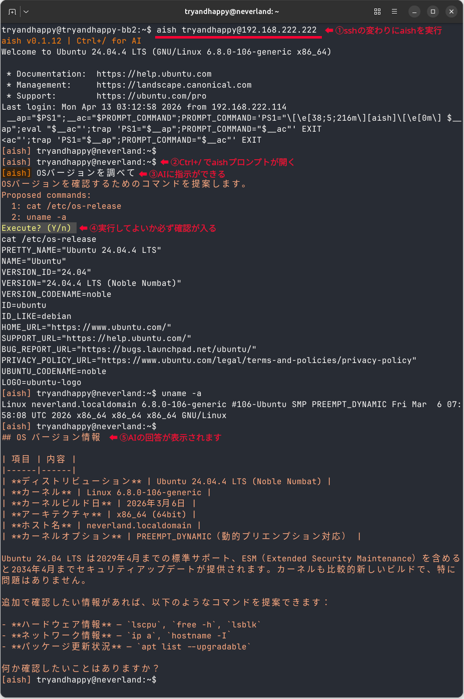

# aish (AI + SSH)

**AI-assisted SSH shell** — Ask Claude Code for help right inside your SSH session.

- `aish` は AI + SSH/Terminal です。
- ターミナルから `Ctrl+/` で AIに問い合わせできます。
- AIと相談しながら作業することができます。
- AIに画面の内容送るので、エラーやログを貼り付ける必要はありません。
- コマンド実行時は必ず確認が入るので安心です。
- クライアントのAI Agentを使用するので、サーバにインストールする必要がありません。



## デモ動画

**SSHモード**
https://github.com/tryandhappy/aish/raw/main/docs/movies/sample-ssh1.mp4

**ローカルモード**
https://github.com/tryandhappy/aish/raw/main/docs/movies/sample-local1.mp4


## 前提条件

#### 対応OS

- Linux (Testing on Ubuntu 24.04)
- macOS (Intel・Apple Silicon)
- Windows WSL2 (Testing on Ubuntu 24.04)

#### 必要なコマンド

- AI CLI (いずれか)
  - [Claude Code](https://code.claude.com/docs/ja/overview)
  - [ChatGPT Codex](https://openai.com/ja-JP/codex/)
  - [Gemini CLI](https://cloud.google.com/blog/ja/topics/developers-practitioners/introducing-gemini-cli/)
  - [Qwen Code](https://qwen.ai/qwencode)
- OpenSSH (リモートSSH)
- bash または zsh (ローカルシェル)
- curl (aish --update)


## 対応AI CLI

- Claude Code CLI (API, Pro, Max, Team, Enterprise) ※FreeはClaude Codeが使えないので未対応 (デフォルト)
- OpenAI ChatGPT Codex
- Google Gemini
- Qwen Code (未テスト)


## インストール

### Linux

```bash
sudo curl -fsSL -o /usr/local/bin/aish \
  "https://github.com/tryandhappy/aish/releases/latest/download/aish-$(uname -m)-unknown-linux-musl"

sudo chmod 755 /usr/local/bin/aish
```

### macOS (Intel・Apple Silicon)

```bash
sudo mkdir -p /usr/local/bin

ARCH=$(uname -m); case "$ARCH" in arm64|aarch64) ARCH=aarch64;; x86_64|amd64) ARCH=x86_64;; esac

sudo curl -fsSL -o /usr/local/bin/aish \
  "https://github.com/tryandhappy/aish/releases/latest/download/aish-$ARCH-apple-darwin"

sudo chmod 755 /usr/local/bin/aish
```


## アップデート

```bash
sudo aish --update
```


### 開発用 ビルド＆インストール (開発版を /usr/local/bin/aish に上書き)

```bash
cargo build --release && sudo install -m 755 target/release/aish /usr/local/bin/aish
```


## 基本的な使い方

AI Agentにログインして、aishコマンドを実行。あとはいつもどおりSSH/Terminal。
AIへの問い合わせは Crtl + /

### Claude Code (Default)
```bash
# Login
claude login

# Sample
aish
aish --ai claude
aish --ai claude --model opus
aish --ai claude --model opus --effort xhigh

# Usage
aish --ai claude \
  --model sonnet|opus|haiku|best|claude-opus-4-8|sonnet[1m]|opus[1m] \
  --effort low|medium|high|xhigh|max|ultracode
```

### Codex
```bash
# Login
codex login

# Sample
aish --ai codex
aish --ai codex --model gpt-5.5
aish --ai codex --model gpt-5.5 --effort xhigh

# Usage
aish --ai \
  codex --model gpt-5.5|gpt-5.4|gpt-g.4-mini \
  --effort low|medium|high|xhigh
```

### Gemini
``` bash
# Login
gemini login

# Sample
aish --ai gemini
```

### Qwen
```bash
qwen

aish --ai qwen
```


## 対話シェルを常に aish にする

極めて便利です。
aishいらないときはexitしてください。

### bash (Linux / WSL2 Ubuntu等)

`~/.bashrc` の **末尾** に以下を追加。

```bash
if [[ $- == *i* && -z "$AISH_PID" ]]; then
    # Exit returns to bash.
    PROMPT_COMMAND='unset PROMPT_COMMAND; command -v aish >/dev/null && aish'
    # Exit closes the terminal.
    #PROMPT_COMMAND='unset PROMPT_COMMAND; command -v aish >/dev/null && exec aish'
fi
```

### zsh (macOS のデフォルト)

`~/.zprofile` の **末尾** に以下を追加。`.zprofile` はログインシェルでだけ読まれ、aish が起動する子 zsh はログインシェルではないので再帰しません (`AISH_PID` ガードは保険)。

```zsh
if [[ -o interactive && -z "$AISH_PID" ]]; then
    # Exit returns to zsh.
    command -v aish >/dev/null && aish
    # Exit closes the terminal.
    #command -v aish >/dev/null && exec aish
fi
```

## コミュニティ

バグ報告・ご意見・ご相談はDiscordまたはXで受け付けています。
お気軽にご相談ください。皆様の話がアイディアの元になり大変貴重です。
(返事が遅くなったらごめんなさい。)

###### Discord

https://discord.gg/nj3xz6RBQC

###### X

https://x.com/tryandhappy

